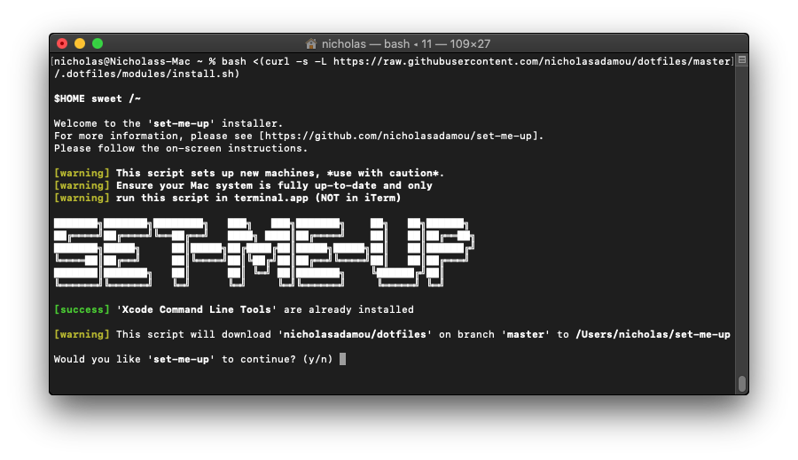

# `set-me-up` installer



This is the universal installer script used to install 'set-me-up' (smu) on a Mac or *debian* based machine.

## Obtaining `set-me-up` installer

To start, your default shell must be set to `bash` prior to executing the `install` snippet for the first time. This is because on newer versions of Mac OS, the default shell is `zsh` instead of `bash`. To change your default shell, run the following command in your console.

```bash
sudo chsh -s $(which bash) $(whoami)
```

Once the default shell is `bash`, close and reopen the terminal window. Then, run the following command in your console.

(⚠️ **DO NOT** run the `install` snippet if you don't fully
understand [what it does](../install.sh). Seriously, **DON'T**!)

```bash
bash <(curl -s -L https://raw.githubusercontent.com/nicholasadamou/set-me-up-installer/main/install.sh)
```

You can change the `smu` home directory by setting an environment variable called `SMU_HOME_DIR`. Please keep the variable declared or else the `smu` scripts are unable to pickup the sources.

```bash
export SMU_HOME_DIR="some-path" \
    bash <(curl -s -L https://raw.githubusercontent.com/nicholasadamou/set-me-up-installer/main/install.sh)
```

## Liability

The creator of this repo is _not responsible_ if your machine ends up in a state you are not happy with.

## Contributions

Yes please! This is a GitHub repo. I encourage anyone to contribute. 😃

## License

The code is available under the [MIT license](LICENSE).